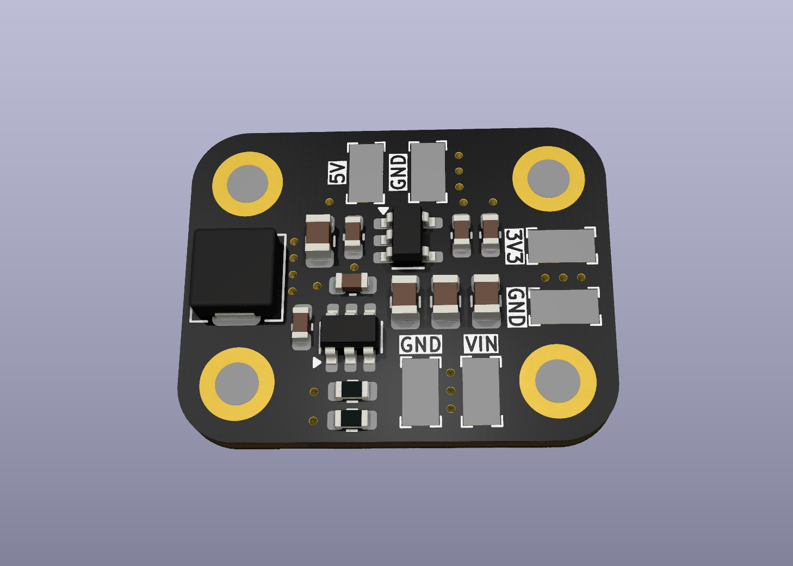
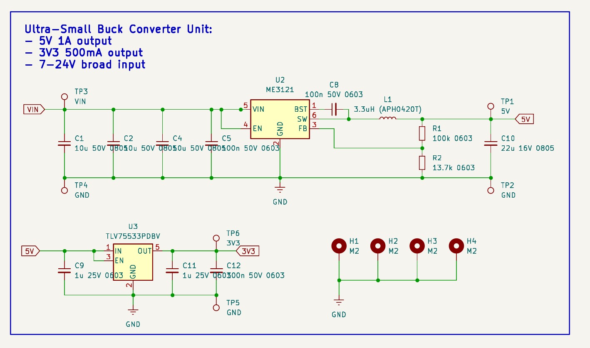
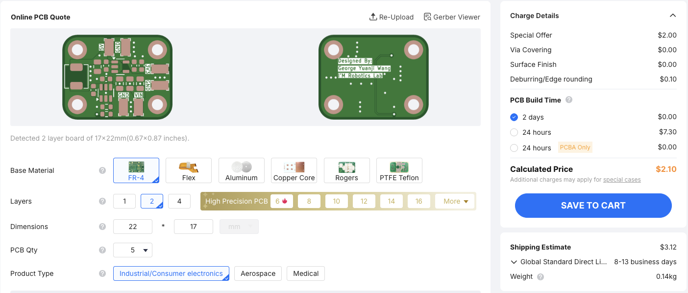

# A Simple Buck Converter Unit with ME3121

VIN Input: 5-40V

Output: 5V 1A; 3.3V 500mA

Dimension: 22 x 17 mm

This is a very compact Buck Converter Unit that turns a wide range of input voltage into the common 5V and 3.3V. It is cheap and have better performance than LM2596.

|  |  |
|-------------------------|-----------------------------------|

## Schematics

## Order / Manufacturing

Download the `Gerber.zip` file from release and submit it to [JLCPCB](https://cart.jlcpcb.com/quote?spm=jlcpcb.Public.2006), leave everything set as default. 

